# 個人財務管理システム / 个人财务管理系统

## スクリーンショット / 画面截图

> 以下のスクリーンショットは日本語画面で、ログイン、登録、ホーム、カテゴリ管理、収支記録、統計分析、AI アシスタント、スマートフォン表示を示しています。  
> 以下截图使用日本語界面，展示登录、注册、首页、分类管理、收支记录、统计分析、AI 助手和移动端响应式页面。

### PC 表示 / 桌面端

#### ログイン / 登录

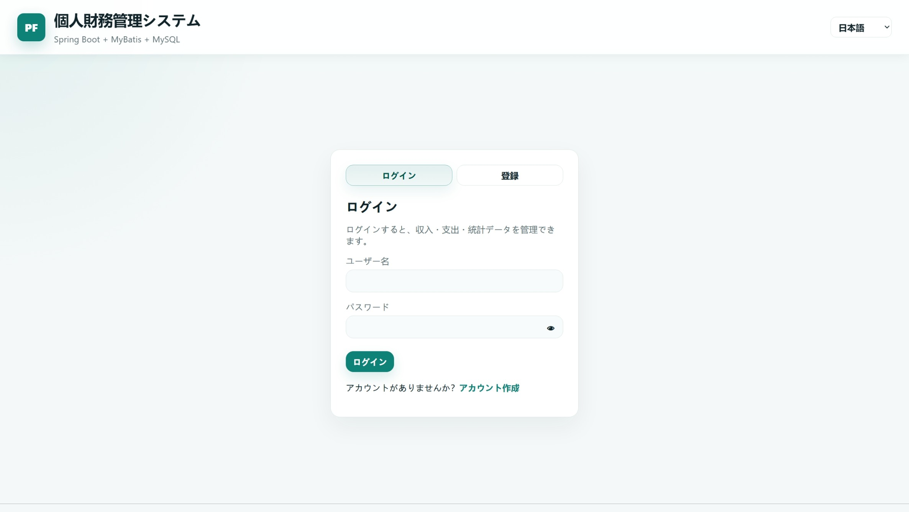

#### 登録 / 注册

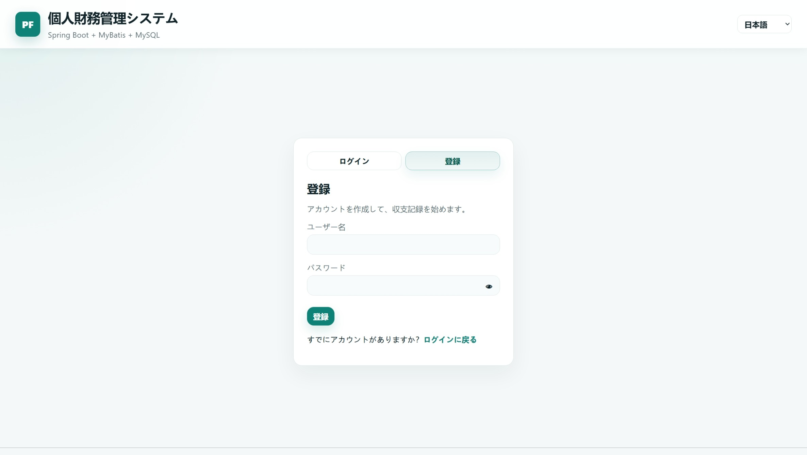

#### ホーム / 首页

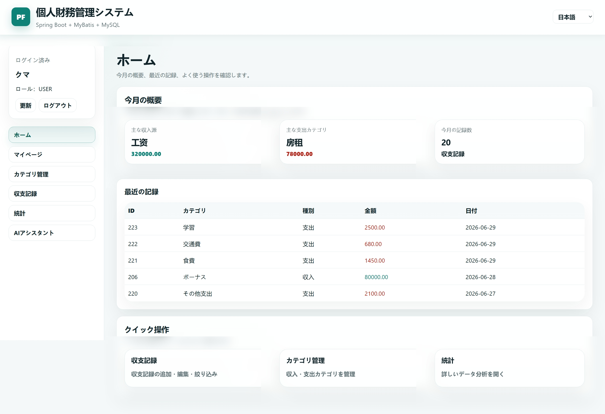

#### マイページ / 我的页面

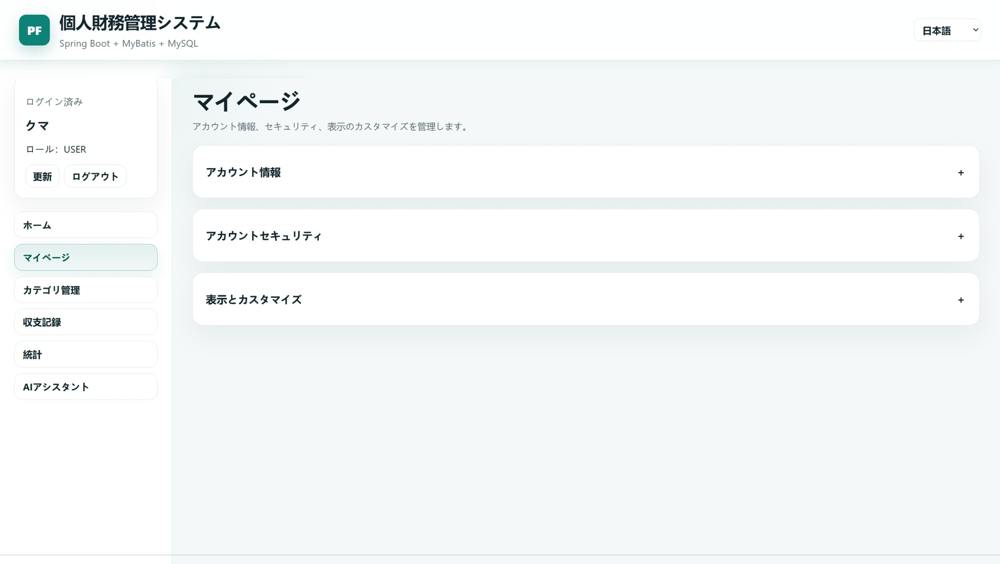

#### カテゴリ管理 / 分类管理

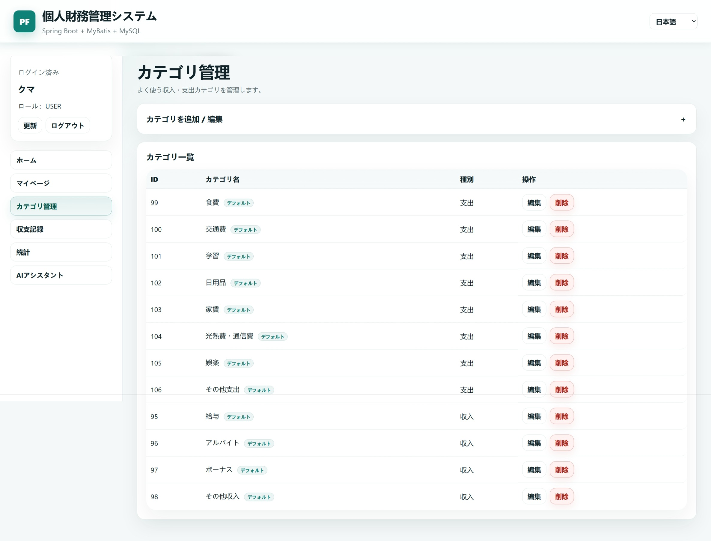

#### 収支記録 / 收支记录

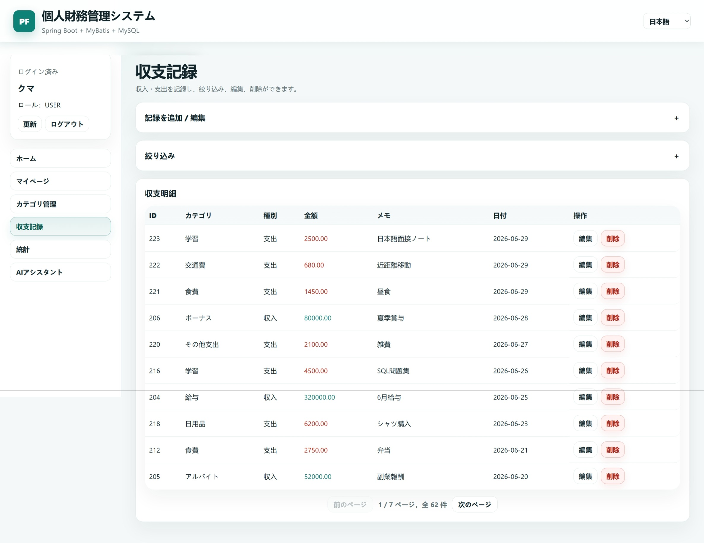

#### 統計分析 / 统计分析

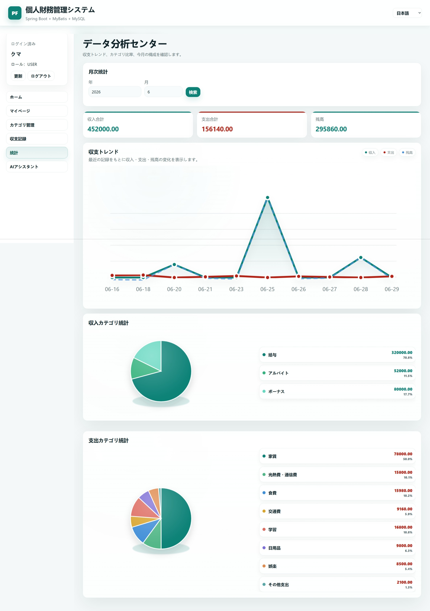

#### AI アシスタント / AI 助手

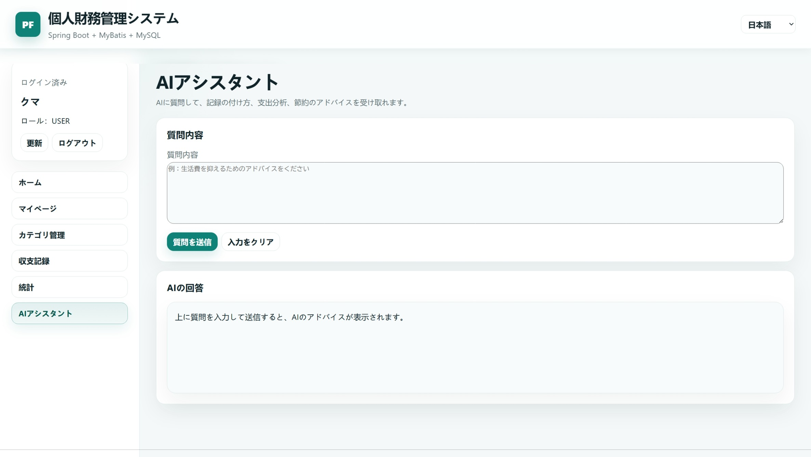

### スマートフォン表示 / 移动端

<p>
  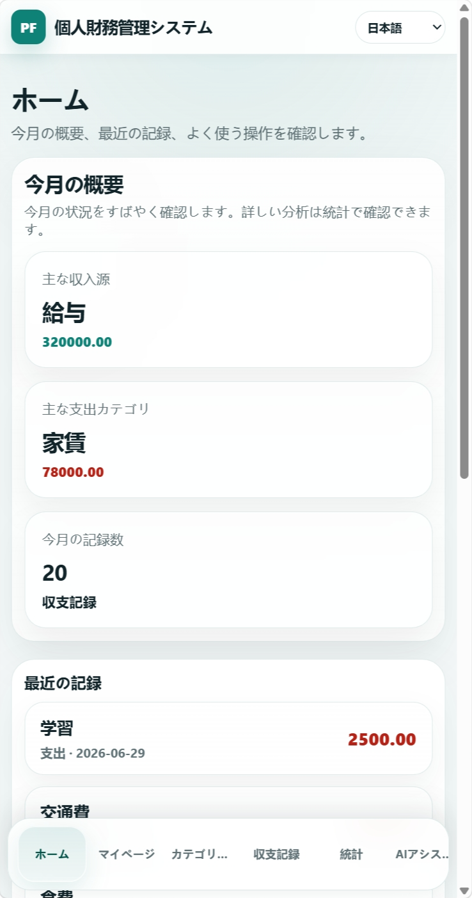
  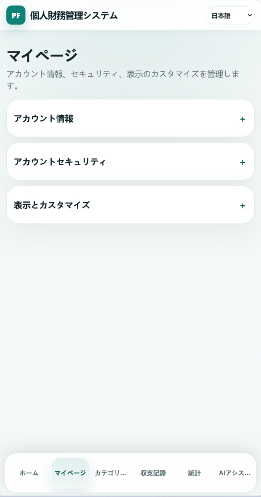
  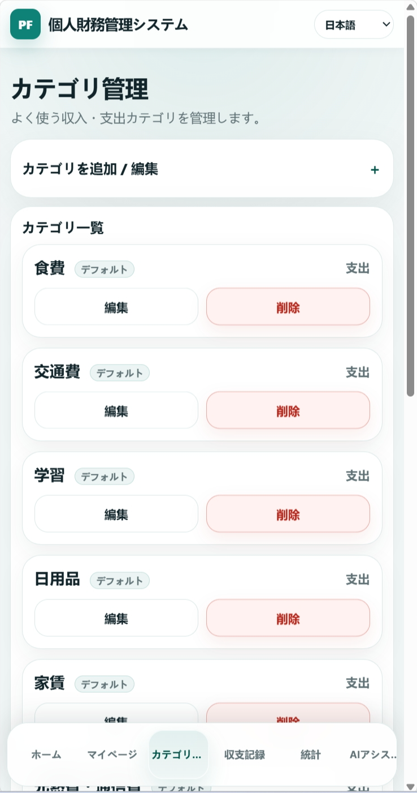
</p>

<p>
  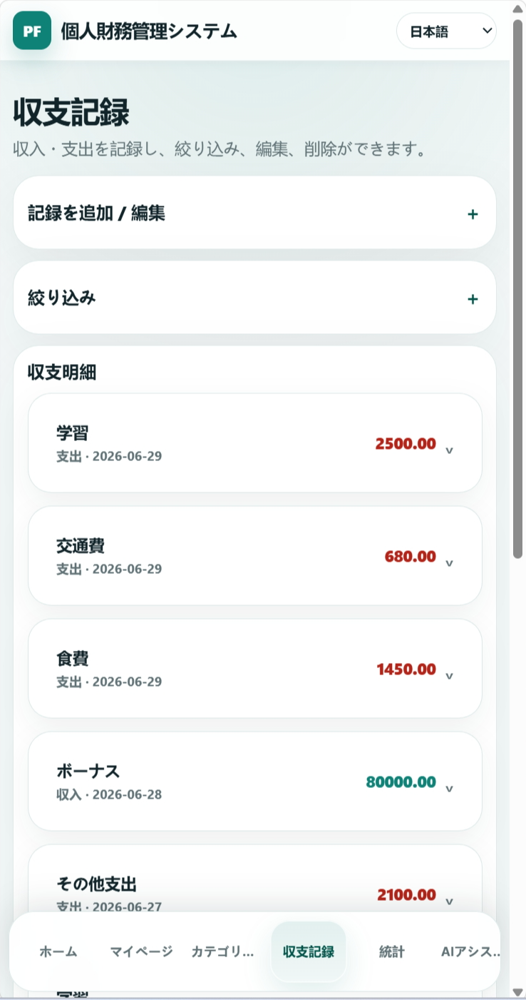
  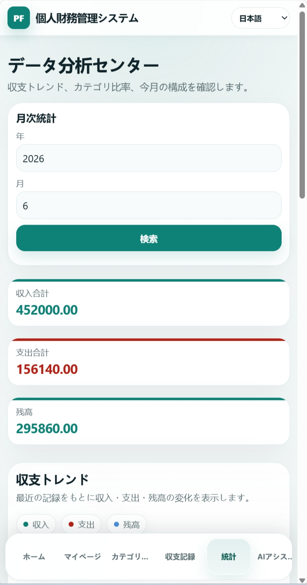
  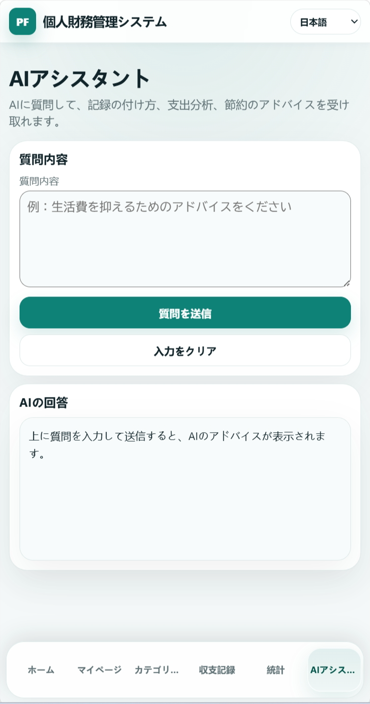
</p>

## プロジェクト概要 / 项目简介

日本語説明：

このプロジェクトは **Java 17 + Spring Boot + MyBatis + MySQL + Vue 3 + Vite** を使用した個人財務管理システムです。ユーザー認証、デフォルト収支カテゴリの自動作成、収支カテゴリ、収支記録、ページング検索、統計、管理者機能、Swagger / OpenAPI、AI 財務アシスタント、レスポンシブ対応のフロント画面を実装しており、初級 Java バックエンドエンジニア向けのポートフォリオとして整理しています。

中文说明：

这是一个基于 **Java 17 + Spring Boot + MyBatis + MySQL + Vue 3 + Vite** 的个人财务管理系统。项目实现了用户认证、默认收支分类初始化、收支分类、收支记录、分页筛选、统计分析、管理员管理、Swagger / OpenAPI 文档、AI 财务助手和响应式前端页面，适合作为初级 Java 后端求职展示项目。

---

## 技術スタック / 技术栈

| 日本語 | 中文 |
|---|---|
| バックエンド：Java 17, Spring Boot 3.5.15, Spring MVC | 后端：Java 17, Spring Boot 3.5.15, Spring MVC |
| データベース：MySQL 8.0.34 | 数据库：MySQL 8.0.34 |
| ORM / SQL：MyBatis, MyBatis XML | ORM / SQL：MyBatis, MyBatis XML |
| ビルドツール：Maven | 构建工具：Maven |
| 入力チェック：Service 層の業務チェック / Spring Validation | 参数校验：Service 层业务校验 / Spring Validation |
| ログイン認証：Token, Spring MVC Interceptor | 登录认证：Token, Spring MVC Interceptor |
| API ドキュメント：Swagger / OpenAPI | 接口文档：Swagger / OpenAPI |
| AI API：OpenRouter AI API, RestTemplate | AI API：OpenRouter AI API, RestTemplate |
| フロントエンド：Vue 3.5.x, Vite 6.x, HTML, CSS, JavaScript | 前端：Vue 3.5.x, Vite 6.x, HTML, CSS, JavaScript |
| 開発ツール：IntelliJ IDEA, Git | 开发工具：IntelliJ IDEA, Git |

---

## 開発環境 / 开发环境

| 日本語 | 中文 |
|---|---|
| JDK：Java 17 | JDK：Java 17 |
| Spring Boot：3.5.15 | Spring Boot：3.5.15 |
| MyBatis Spring Boot Starter：3.0.5 | MyBatis Spring Boot Starter：3.0.5 |
| Springdoc OpenAPI：2.8.9 | Springdoc OpenAPI：2.8.9 |
| データベース：MySQL 8.x（開発環境：8.0.34） | 数据库：MySQL 8.x（开发环境：8.0.34） |
| フロントエンド：Vue 3.5.x + Vite 6.x | 前端：Vue 3.5.x + Vite 6.x |
| ビルド：Maven / npm run build | 构建：Maven / npm run build |

---

## 開発補足 / 开发补充说明

日本語説明：

このプロジェクトは Java バックエンド学習と面接準備を主目的として作成しました。バックエンドの認証、Controller / Service / Mapper / XML の分層、MyBatis SQL、Token 認証、権限制御、入力チェック、統計処理などを重点的に実装・理解しています。フロントエンド画面は AI 支援を利用して作成し、API 連携、表示調整、多言語対応、レスポンシブ確認は自分で確認しながら修正しました。

中文说明：

这个项目主要用于 Java 后端学习和面试准备。重点是理解并实现后端认证、Controller / Service / Mapper / XML 分层、MyBatis SQL、Token 验证、权限控制、参数校验和统计处理等内容。前端页面是在 AI 辅助下完成的，我主要负责接口对接、显示调整、多语言处理和响应式效果确认。

---

## 主な機能 / 主要功能

| 日本語 | 中文 |
|---|---|
| ユーザー登録・ログイン・ログアウト | 用户注册、登录、退出 |
| Token によるログイン認証 | Token 登录认证 |
| ログイン中ユーザー情報の確認 | 个人信息查看 |
| パスワード変更 | 修改密码 |
| 管理者によるユーザー管理 | 管理员用户管理 |
| 収支カテゴリ管理 | 收支分类管理 |
| 新規ユーザーのデフォルトカテゴリ自動作成 | 新用户默认分类初始化 |
| 収支記録管理 | 收支记录管理 |
| ページング検索と条件検索 | 分页查询和条件筛选 |
| 月次統計 | 月度统计 |
| 収入 / 支出のカテゴリ別集計 | 收入 / 支出分类统计 |
| AI 財務アシスタント | AI 财务助手 |
| 中国語・日本語・英語の切り替え | 中日英多语言切换 |
| デフォルトカテゴリ名の多言語表示 | 默认分类根据语言自动显示 |
| レスポンシブレイアウト、PC・スマートフォン対応 | 响应式布局，支持 PC 和手机端 |
| ダークモードとテーマカラー設定 | 深色模式和主题色设置 |
| パスワード表示 / 非表示 | 密码显示 / 隐藏 |
| 金額入力チェック | 金额输入校验 |

---

## プロジェクト構成 / 项目结构

日本語説明：

```text
src/main/java/com/study/usermanagement
  common       共通レスポンス Result
  config       WebConfig, OpenApiConfig
  controller   HTTP リクエストを受け取る層
  dto          リクエストボディ用オブジェクト
  entity       データベースのエンティティ
  exception    共通例外処理
  interceptor  Token ログイン認証と管理者権限チェック
  mapper       MyBatis Mapper インターフェース
  service      業務ロジック
  vo           フロントへ返す表示用オブジェクト

src/main/resources
  mapper       MyBatis XML SQL ファイル
  static       Vue ビルド後の静的フロント画面

frontend
  src          Vue 3 フロントエンドソース
  components   共通コンポーネント
  views        画面コンポーネント
  api          フロントエンド API リクエスト
  i18n         中国語・日本語・英語の多言語設定
  styles       フロントエンドスタイル
  dist         Vite ビルド出力ディレクトリ
```

中文说明：

```text
src/main/java/com/study/usermanagement
  common       统一返回结果 Result
  config       WebConfig, OpenApiConfig
  controller   接收 HTTP 请求
  dto          接收请求体数据
  entity       数据库实体对象
  exception    统一异常处理
  interceptor  Token 登录校验和管理员权限校验
  mapper       MyBatis Mapper 接口
  service      业务逻辑
  vo           返回给前端的展示对象

src/main/resources
  mapper       MyBatis XML SQL 文件
  static       Vue 打包后的静态前端页面

frontend
  src          Vue 3 前端源码
  components   通用组件
  views        页面组件
  api          前端接口请求
  i18n         中日英多语言配置
  styles       前端样式
  dist         Vite 打包输出目录
```


---

## バックエンド機能説明 / 后端功能说明

### ユーザー認証 / 用户认证

| 日本語 | 中文 |
|---|---|
| `POST /users` で一般ユーザーを登録 | `POST /users` 注册普通用户 |
| `POST /login` 成功時に Token を生成 | `POST /login` 登录成功后生成 Token |
| Token は DB の `user.token` に保存 | Token 保存到数据库 `user.token` 字段 |
| `POST /logout` で現在ユーザーの Token をクリア | `POST /logout` 清空当前用户 Token |
| 以降のリクエストは `Authorization` ヘッダーで Token を送信 | 后续请求通过 `Authorization` 请求头携带 Token |

### ログイン中ユーザー / 当前用户

| 日本語 | 中文 |
|---|---|
| `GET /me` でログイン中ユーザー情報を取得 | `GET /me` 查看当前登录用户信息 |
| `PUT /me/password` で自分のパスワードを変更 | `PUT /me/password` 修改自己的密码 |
| パスワード変更には現在のパスワードと新しいパスワードが必要 | 修改密码需要旧密码和新密码 |
| ユーザー情報は `UserVO` で返し、パスワードは返さない | 返回用户信息时使用 `UserVO`，不返回密码 |

### 管理者ユーザー管理 / 管理员用户管理

| 日本語 | 中文 |
|---|---|
| 管理者は全ユーザーを取得できる | 管理员可以查询全部用户 |
| 管理者はユーザー名でユーザーを検索できる | 管理员可以按用户名查询用户 |
| 管理者はユーザーのパスワードをリセットできる | 管理员可以重置用户密码 |
| 管理者はユーザーを削除できる | 管理员可以删除用户 |
| `/admin/**` は `ADMIN` ロールのみアクセス可能 | `/admin/**` 只有 `ADMIN` 角色可以访问 |

### 収支カテゴリ管理 / 收支分类管理

| 日本語 | 中文 |
|---|---|
| 新規登録後、一般的な収入 / 支出カテゴリを自動作成 | 新用户注册后自动生成常用收入 / 支出默认分类 |
| ログイン中ユーザーは収入 / 支出カテゴリを追加できる | 当前用户可以新增收入 / 支出分类 |
| 自分のカテゴリを取得・更新・削除できる | 当前用户可以查询、修改、删除自己的分类 |
| カテゴリタイプは `income` と `expense` | 分类类型使用 `income` 和 `expense` |
| デフォルトカテゴリは `code` と `is_default` で管理し、画面では言語に応じて表示 | 默认分类使用 `code` 和 `is_default` 标识，前端根据语言显示名称 |
| ユーザーがデフォルトカテゴリを編集した場合、カスタムカテゴリとして扱う | 用户手动编辑默认分类后，分类会转为自定义分类 |
| 同じユーザー内で同じタイプ・同じ名前のカテゴリは重複不可 | 同一用户下同类型同名称分类不能重复 |
| 収支記録が紐づいているカテゴリは削除不可 | 分类下已有收支记录时，不允许删除分类 |

### 収支記録管理 / 收支记录管理

| 日本語 | 中文 |
|---|---|
| ログイン中ユーザーは自分の収支記録を追加・取得・更新・削除できる | 当前用户可以新增、查询、修改、删除自己的收支记录 |
| 追加・更新時にカテゴリが本人のものか確認する | 新增和修改记录时，会校验分类是否属于当前用户 |
| 記録タイプとカテゴリタイプは一致する必要がある | 记录类型必须和分类类型一致 |
| タイプ、日付範囲、カテゴリで検索できる | 支持按类型、日期范围、分类查询 |
| ページング検索と複合条件検索に対応 | 支持分页查询和组合条件筛选 |

### 統計機能 / 统计功能

| 日本語 | 中文 |
|---|---|
| 指定年月の収入合計を取得 | 查询指定年月的收入合计 |
| 指定年月の支出合計を取得 | 查询指定年月的支出合计 |
| 指定年月の残高を取得 | 查询指定年月的结余 |
| 収入カテゴリ別に金額を集計 | 按收入分类统计金额 |
| 支出カテゴリ別に金額を集計 | 按支出分类统计金额 |
| フロントでカテゴリ別集計をグラフ表示 | 前端用图表展示分类统计 |

### AI 財務アシスタント / AI 财务助手

| 日本語 | 中文 |
|---|---|
| フロントに AI アシスタント画面を用意 | 前端提供 AI 助手页面 |
| 現在はユーザーの実際の収支データとは連携せず、一般的な家計管理・節約・予算管理に関する質問に回答 | 目前不直接联动用户真实收支数据，主要回答一般记账、节约、预算管理相关问题 |
| 今後はユーザーの収支データをもとに、支出傾向分析やカテゴリ別アドバイスを追加予定 | 后续计划结合用户收支数据，实现支出趋势分析和分类建议 |
| バックエンドの `AiService` が OpenRouter AI API を呼び出す | 后端 `AiService` 调用 OpenRouter AI API |
| `RestTemplate` で HTTP リクエストを送信 | 使用 `RestTemplate` 发送 HTTP 请求 |
| API Key は `OPENROUTER_API_KEY` 環境変数から読み込む | API Key 通过 `OPENROUTER_API_KEY` 环境变量读取 |
| プロンプト漏えい系の質問に対する簡単な防御を実装 | 对提示词泄露类问题做了简单防护 |

### フロントエンド機能 / 前端功能

| 日本語 | 中文 |
|---|---|
| Vue 3 + Vite でコンポーネント化されたフロントを実装 | 使用 Vue 3 + Vite 实现组件化前端 |
| 中国語・日本語・英語の切り替えに対応 | 支持中文、日语、英语切换 |
| ログイン、登録、ホーム、カテゴリ、記録、統計、管理者、AI 画面 | 登录、注册、首页、分类、记录、统计、管理员、AI 页面 |
| パスワード入力欄は表示 / 非表示を切り替え可能 | 密码输入框支持显示 / 隐藏 |
| 金額入力欄に最小値、最大値、小数桁を設定 | 金额输入框设置最小值、最大值和小数位 |
| PC とスマートフォン表示に対応 | PC 和手机端布局适配 |
| グラフ、モバイルカード、管理者画面のモバイル対応 | 统计图、移动端卡片、管理员页面移动端适配 |

---

## セキュリティと業務チェック / 安全和业务校验

| 日本語 | 中文 |
|---|---|
| 一般ユーザーは自分のデータだけ操作できる | 普通用户只能操作自己的数据 |
| バックエンドは Token から現在ユーザーを取得し、フロントの `userId` に依存しない | 后端通过 Token 查询当前用户，不依赖前端传入 `userId` |
| 管理者はユーザー確認、パスワードリセット、削除ができる | 管理员可以查看用户、重置密码、删除用户 |
| `/admin/**` API は `ADMIN` ロールが必要 | `/admin/**` 接口需要 `ADMIN` 角色 |
| 金額項目は `DECIMAL(10,2)` を想定 | 金额字段按 `DECIMAL(10,2)` 设计 |
| フロントでは `0.01` から `99999999.99`、小数ステップ `0.01` に制限 | 前端金额输入限制为 `0.01` 到 `99999999.99`，小数步长 `0.01` |
| バックエンドでは金額が 0 より大きいことを確認し、範囲・小数桁チェックのロジックも保持 | 后端校验金额必须大于 0，并保留范围和小数位校验逻辑 |
| 収支記録があるカテゴリは削除不可 | 分类下已有收支记录时，不允许删除分类 |
| 収支記録のカテゴリはログイン中ユーザー本人のものに限る | 收支记录的分类必须属于当前登录用户 |
| 収支記録タイプとカテゴリタイプは一致が必要 | 收支记录类型必须和分类类型一致 |
| OpenRouter API Key は環境変数 `OPENROUTER_API_KEY` を使用 | OpenRouter API Key 使用环境变量 `OPENROUTER_API_KEY` |
| API Key はコードに直書きせず、フロントにも公開しない | API Key 不写死在代码中，也不暴露给前端 |
| AI アシスタントは現在、実際の収支データを外部 AI API に送信しない設計 | AI 助手目前设计为不把真实收支数据发送给外部 AI API |

---

## 主な API / 主要接口

| Method | Path | 日本語 | 中文 |
|---|---|---|---|
| POST | `/users` | ユーザー登録 | 用户注册 |
| POST | `/login` | ログイン | 用户登录 |
| POST | `/logout` | ログアウト | 退出登录 |
| GET | `/me` | ログイン中ユーザー情報取得 | 查看当前用户信息 |
| PUT | `/me/password` | パスワード変更 | 修改当前用户密码 |
| GET | `/admin/users` | 管理者：全ユーザー取得 | 管理员查询全部用户 |
| GET | `/admin/users/{username}` | 管理者：指定ユーザー取得 | 管理员查询指定用户 |
| PUT | `/admin/users/{username}/password` | 管理者：パスワードリセット | 管理员重置密码 |
| DELETE | `/admin/users/{username}` | 管理者：ユーザー削除 | 管理员删除用户 |
| POST | `/transaction-categories` | 収支カテゴリ追加 | 新增收支分类 |
| GET | `/transaction-categories` | 自分のカテゴリ取得 | 查询自己的分类 |
| PUT | `/transaction-categories/{id}` | 自分のカテゴリ更新 | 修改自己的分类 |
| DELETE | `/transaction-categories/{id}` | 自分のカテゴリ削除 | 删除自己的分类 |
| POST | `/transaction-records` | 収支記録追加 | 新增收支记录 |
| GET | `/transaction-records` | 自分の全記録取得 | 查询自己的全部记录 |
| PUT | `/transaction-records/{id}` | 自分の記録更新 | 修改自己的记录 |
| DELETE | `/transaction-records/{id}` | 自分の記録削除 | 删除自己的记录 |
| GET | `/transaction-records/page` | ページング検索 | 分页查询 |
| GET | `/transaction-records/search` | 条件付きページング検索 | 条件筛选分页查询 |
| GET | `/transaction-stats/month` | 月次統計 | 月度统计 |
| GET | `/transaction-stats/category/{type}` | 収入 / 支出カテゴリ別集計 | 收入 / 支出分类统计 |
| POST | `/ai/chat` | AI 財務アシスタント | AI 财务助手 |

---

## データベース / 数据库

日本語説明：

現在の開発環境では **MySQL 8.0.34** を使用しています。データベース名は `personal_finance` です。主に `user`、`transaction_category`、`transaction_record` の3つのテーブルを使用します。文字化けを防ぐため `utf8mb4` を使用し、文字列比較を区分するため `utf8mb4_bin` を指定しています。

中文说明：

当前开发环境使用 **MySQL 8.0.34**，数据库名为 `personal_finance`。项目主要使用三张表：`user`、`transaction_category`、`transaction_record`。项目使用 `utf8mb4` 防止中文、日文乱码，并使用 `utf8mb4_bin` 让字符串比较区分大小写。


参考 SQL：

```sql
CREATE DATABASE IF NOT EXISTS personal_finance
  DEFAULT CHARACTER SET utf8mb4
  DEFAULT COLLATE utf8mb4_bin;

USE personal_finance;

CREATE TABLE `user` (
  id INT PRIMARY KEY AUTO_INCREMENT,
  username VARCHAR(20) NOT NULL UNIQUE,
  password VARCHAR(20) NOT NULL,
  register_date DATE,
  role VARCHAR(20) NOT NULL DEFAULT 'USER',
  token VARCHAR(100)
);

CREATE TABLE transaction_category (
  id INT PRIMARY KEY AUTO_INCREMENT,
  user_id INT NOT NULL,
  name VARCHAR(50) NOT NULL,
  type VARCHAR(20) NOT NULL,
  code VARCHAR(50) NULL COMMENT '默认分类编码',
  is_default TINYINT(1) NOT NULL DEFAULT 0 COMMENT '是否系统默认分类'
);

CREATE TABLE transaction_record (
  id INT PRIMARY KEY AUTO_INCREMENT,
  user_id INT NOT NULL,
  category_id INT NOT NULL,
  type VARCHAR(20) NOT NULL,
  amount DECIMAL(10, 2) NOT NULL,
  remark VARCHAR(255),
  record_date DATE NOT NULL
);
```

---

## 実行方法 / 运行方法

### MySQL データベース作成 / 1. 创建 MySQL 数据库

日本語説明：

まず `personal_finance` データベースを作成し、その後 `user`、`transaction_category`、`transaction_record` の3テーブルを作成します。本プロジェクトでは文字化けを防ぐため `utf8mb4` を使用し、文字列比較を区分するため `utf8mb4_bin` を指定しています。

中文说明：

先创建数据库 `personal_finance`，再创建 `user`、`transaction_category`、`transaction_record` 三张表。本项目使用 `utf8mb4` 防止中文、日文乱码，并使用 `utf8mb4_bin` 让字符串比较区分大小写。


```sql
CREATE DATABASE IF NOT EXISTS personal_finance
  DEFAULT CHARACTER SET utf8mb4
  DEFAULT COLLATE utf8mb4_bin;
```

### DB 設定の変更 / 2. 修改数据库配置

日本語説明：

`src/main/resources/application.properties` のデータベース接続情報を自分の環境に合わせて変更します。

中文说明：

修改 `src/main/resources/application.properties` 中的数据库连接信息。


```properties
spring.datasource.url=jdbc:mysql://localhost:3306/personal_finance?useSSL=false&serverTimezone=Asia/Tokyo
spring.datasource.username=root
spring.datasource.password=root
spring.datasource.driver-class-name=com.mysql.cj.jdbc.Driver
```

### OPENROUTER_API_KEY 環境変数の設定 / 3. 设置 OPENROUTER_API_KEY 环境变量

日本語説明：

OpenRouter API Key はコードに直接書かず、環境変数として設定します。

中文说明：

OpenRouter API Key 不写死在代码里，需要通过环境变量设置。


PowerShell 示例：

```powershell
$env:OPENROUTER_API_KEY="your_api_key_here"
```

IntelliJ IDEA 中也可以在 Run Configuration 的 Environment variables 中设置：

```text
OPENROUTER_API_KEY=your_api_key_here
```

### Spring Boot 起動 / 4. 启动 Spring Boot

日本語説明：

IntelliJ IDEA で `UserManagementApiApplication` を実行するか、Maven で起動します。

中文说明：

可以在 IntelliJ IDEA 中运行 `UserManagementApiApplication`，也可以使用 Maven 启动。


```powershell
.\mvnw.cmd spring-boot:run
```

### フロント開発モード / 5. 前端开发模式

日本語説明：

フロントエンドのソースコードは `frontend` ディレクトリにあります。開発時は Vite の開発サーバーを起動し、通常 `http://localhost:5173/` で確認します。API リクエストは Vite の proxy により Spring Boot へ転送されます。

中文说明：

前端源码位于 `frontend` 目录。开发时可以使用 Vite 启动前端开发服务器，默认访问 `http://localhost:5173/`。前端请求会通过 Vite 代理转发到 Spring Boot 后端。


```powershell
cd frontend
npm install
npm run dev
```

### フロントを Spring Boot にビルド / 6. 打包前端到 Spring Boot

日本語説明：

提出・デプロイ前に Vue をビルドします。ビルド後のファイルは Spring Boot の `src/main/resources/static` に出力されるため、Spring Boot を起動するだけで `http://localhost:8080/` から Vue 画面にアクセスできます。

中文说明：

最终提交或部署前，执行 Vue 打包命令。打包后的文件会输出到 Spring Boot 的 `src/main/resources/static`，之后只启动 Spring Boot，就可以通过 `http://localhost:8080/` 访问 Vue 页面。


```powershell
cd frontend
npm run build
```

### ブラウザでアクセス / 7. 浏览器访问

| 日本語 | 中文 | URL |
|---|---|---|
| フロント画面（Spring Boot からアクセス） | 前端页面（Spring Boot 正式访问） | http://localhost:8080/ |
| フロント画面（Vite 開発モード） | 前端页面（Vite 开发模式） | http://localhost:5173/ |
| Swagger UI | Swagger UI | http://localhost:8080/swagger-ui/index.html |
| OpenAPI JSON | OpenAPI JSON | http://localhost:8080/v3/api-docs |

---

## 設定ファイル / 配置文件

日本語説明：

主な設定は `src/main/resources/application.properties` にあります。

中文说明：

项目主要配置在 `src/main/resources/application.properties`。


```properties
spring.application.name=personal-finance-management-system

spring.datasource.url=jdbc:mysql://localhost:3306/personal_finance?useSSL=false&serverTimezone=Asia/Tokyo
spring.datasource.username=root
spring.datasource.password=root
spring.datasource.driver-class-name=com.mysql.cj.jdbc.Driver

mybatis.mapper-locations=classpath:mapper/*.xml

openrouter.api-key=${OPENROUTER_API_KEY}
openrouter.api-url=https://openrouter.ai/api/v1/chat/completions
openrouter.model=openai/gpt-oss-20b:free
```

---

## リクエスト例 / 请求示例

### ログイン / 登录

```http
POST http://localhost:8080/login
Content-Type: application/json

{
  "username": "tom",
  "password": "123456"
}
```

### 収支カテゴリ追加 / 新增收支分类

```http
POST http://localhost:8080/transaction-categories
Content-Type: application/json
Authorization: your_token_here

{
  "name": "餐饮",
  "type": "expense"
}
```

### 収支記録追加 / 新增收支记录

```http
POST http://localhost:8080/transaction-records
Content-Type: application/json
Authorization: your_token_here

{
  "categoryId": 1,
  "type": "expense",
  "amount": 120.50,
  "remark": "晚饭",
  "recordDate": "2026-06-25"
}
```

### 条件付きページング検索 / 条件筛选分页查询

```http
GET http://localhost:8080/transaction-records/search?type=expense&categoryId=1&startRecordDate=2026-06-01&endOfRecordDate=2026-06-30&page=1&size=5
Authorization: your_token_here
```

### AI 財務アシスタント / AI 财务助手

```http
POST http://localhost:8080/ai/chat
Content-Type: application/json
Authorization: your_token_here

{
  "message": "请给我一些控制生活支出的建议"
}
```

---

## 共通レスポンス形式 / 统一返回格式

日本語説明：

バックエンド API は共通の `Result` オブジェクトを返します。

中文说明：

后端接口统一返回 `Result` 对象。


```json
{
  "success": true,
  "message": "查询成功",
  "data": {}
}
```

| 字段 | 日本語 | 中文 |
|---|---|---|
| success | 成功したかどうか | 是否成功 |
| message | レスポンスメッセージ | 返回提示信息 |
| data | 返却データ。オブジェクト、配列、null の場合があります | 返回数据，可以是对象、数组或 null |

---

## OpenAPI / Swagger

日本語説明：

Swagger / OpenAPI を導入しており、ブラウザで API のグループ、パス、パラメータ、説明を確認できます。

中文说明：

项目已接入 Swagger / OpenAPI，可以在浏览器中查看接口分组、路径、参数和说明。


```text
http://localhost:8080/swagger-ui/index.html
```

---

## フロントエンドビルド説明 / 前端构建说明

日本語説明：

本プロジェクトのフロントエンドソースは `frontend` ディレクトリにあり、Vue 3 + Vite を使用しています。開発時は `npm run dev` で `5173` ポートから確認します。提出・デプロイ前は `npm run build` を実行し、Vue を静的ファイルとして `src/main/resources/static` に出力します。そのため、最終的には Spring Boot のみを起動し、`http://localhost:8080/` からアクセスできます。

中文说明：

本项目的前端源码在 `frontend` 目录中，使用 Vue 3 + Vite 开发。开发时使用 `npm run dev` 访问 `5173` 端口；提交或部署前使用 `npm run build`，将 Vue 打包成静态文件输出到 `src/main/resources/static`。因此最终运行时只需要启动 Spring Boot，并访问 `http://localhost:8080/`。


```powershell
cd frontend
npm run build
```


## GitHub 表示用ポイント / GitHub 展示用项目亮点

| 日本語 | 中文 |
|---|---|
| Spring Boot + MyBatis + MySQL で個人財務管理システムを実装 | 使用 Spring Boot + MyBatis + MySQL 实现个人财务管理系统 |
| Controller / Service / Mapper / XML の層構成を採用 | 使用 Controller / Service / Mapper / XML 分层结构 |
| Token と Interceptor でログイン認証を実装 | 使用 Token 和 Interceptor 实现登录认证 |
| role 項目で ADMIN / USER の権限制御を実装 | 使用 role 字段实现 ADMIN / USER 权限控制 |
| 一般ユーザーは自分の収支データのみ操作可能 | 普通用户只能操作自己的收支数据 |
| VO でレスポンスを制御し、パスワードを返さない | 使用 VO 控制返回数据，避免返回密码 |
| 共通例外処理でエラーレスポンスを返す | 使用统一异常处理返回错误信息 |
| 収支記録はページング検索と条件検索に対応 | 收支记录支持分页查询和条件筛选 |
| 統計機能は月次統計とカテゴリ別集計に対応 | 统计模块支持月度统计和分类统计 |
| Vue 3 + Vite でコンポーネント化し、PC・スマートフォンに対応 | Vue 3 + Vite 实现组件化前端，支持 PC 和手机端 |
| フロントは中日英切り替えとパスワード表示 / 非表示に対応 | 前端支持中日英切换和密码显示 / 隐藏 |
| 新規登録後にデフォルトカテゴリを自動作成 | 新用户注册后自动初始化默认分类 |
| デフォルトカテゴリは言語に応じて表示し、カスタムカテゴリはユーザー入力名を保持 | 默认分类根据语言显示，自定义分类保持用户输入名称 |
| Swagger / OpenAPI で API を確認しやすい | 接入 Swagger / OpenAPI，方便查看接口 |
| OpenRouter AI API と連携し、一般的な家計管理質問に答える AI 財務アシスタントを実装 | 接入 OpenRouter AI API，实现回答一般财务管理问题的 AI 财务助手 |
| API Key は環境変数で管理 | API Key 使用环境变量管理 |

---

## ローカル確認 / 本地验证

日本語説明：

Maven でプロジェクトをコンパイルし、コードが正常にビルドできることを確認できます。

中文说明：

可以使用 Maven 编译项目，确认代码可以正常通过编译。


```powershell
.\mvnw.cmd -DskipTests compile
```

成功时会看到：

```text
BUILD SUCCESS
```

---

## 今後の改善 / 后续改进方向

| 日本語 | 中文 |
|---|---|
| パスワードを BCrypt などでハッシュ化して保存 | 密码改为加密保存，例如 BCrypt |
| Token を JWT などより整った認証方式に変更 | Token 改为 JWT 或更完整的认证方案 |
| DB に外部キーやインデックスを追加 | 增加数据库外键和索引 |
| Service 層の単体テストを追加 | 给 Service 层补充单元测试 |
| SQL 初期化スクリプトを追加 | 增加 SQL 初始化脚本 |
| AI アシスタントが実際の収支データを使って分析できるようにする | AI 助手结合当前用户真实收支数据分析 |
| フロント画面とモバイル対応を改善 | 继续优化前端页面和移动端适配 |

